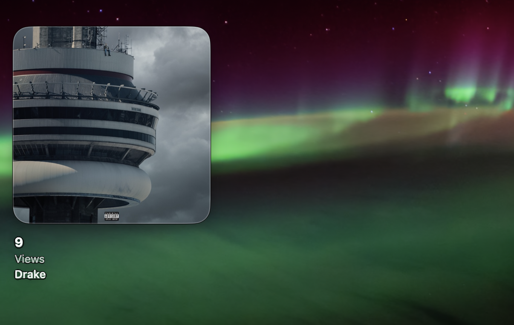

# Musify

A quiet, native macOS desktop music player.
Album artwork first, controls second. It sits on your desktop as a transparent,
borderless window (behind your app windows, like a widget), shows what's playing,
and updates in real time.

Built entirely in SwiftUI + AppKit, no dependencies. Works with **Apple Music**
and **Spotify**.



## Download

### [⬇︎ Download Musify](https://github.com/Priyansh2116/Musify/raw/main/Musify.zip) — macOS 13 or later

**Installing (no terminal needed):**

1. Open the downloaded zip — you'll get **Musify**. Drag it into your **Applications** folder.
2. Double-click **Musify**. macOS will say it *"cannot verify the developer"* — click **Done** (do **not** move it to Trash).
3. Open **System Settings → Privacy & Security**, scroll down to *"Musify was blocked…"*, and click **Open Anyway**.
4. Click **Open Anyway** once more and confirm with your password or Touch ID.
5. Musify appears on your desktop and as a ♪ icon in the menu bar. When it asks, **allow** it to access Apple Music.

> That one-time warning is normal for free Mac apps — this one just isn't paid-notarized by Apple. Your Mac is safe; the source is right here in this repo.

## Build it yourself

```bash
./make_app.sh
open "build/Musify.app"
```

`make_app.sh` compiles a release binary and assembles `Musify.app` — a Dock-less
menu-bar agent. On first launch macOS asks for permission to read / control Apple
Music (and Spotify). Allow it — that's the standard, sandbox-safe way to read
now-playing info and send transport commands, with no private frameworks.

For development:

```bash
swift build        # debug build
swift run Musify   # run in place
```

## Using it

By default Musify appears in the lower-right, in the **Minimal Artwork** style with
a **transparent** background, pinned to the desktop **behind** your windows. Show
your desktop to see it.

- **Drag it anywhere** — click and move from any point on its body.
- **Hover the cover** → play / pause / next / previous fade in over the center.
- Rides along to every Space and works across multiple displays.

Everything else is in the **menu-bar icon** (♪):

- **Style** — Compact · Medium · Minimal Artwork
- **Always on Top** — float above your apps instead of sitting on the desktop
- **Transparent Background** — material panel vs. fully transparent
- **Quit**

## The three styles

| Style | Layout |
| --- | --- |
| **Compact** | 64×64 art · title + artist · play/pause |
| **Medium** | art left · info + prev/play/next right · progress bar + times below |
| **Minimal Artwork** | large cover · tiny controls fade in over center on hover · title / album / artist underneath |

## Design notes

- SF Pro (the system font) and SF Symbols throughout; semantic colors, so light
  and dark adapt automatically.
- Native `NSVisualEffectView` translucency for the non-transparent modes — no fake
  glass, no glow, no heavy shadows. One continuous corner family.
- Artwork **crossfades with a slight 1.03× zoom** on track changes; controls
  spring in on hover; the progress bar interpolates between polls for smooth
  motion. In transparent mode the text carries a soft shadow so it stays readable
  on any wallpaper.

## How it talks to the players

`MusicBridge` runs short **AppleScripts in-process** (`NSAppleScript`, on the main
thread) to read player state / track info and to send play-pause / next /
previous / seek. It only ever scripts an app that's actually running (detected via
`NSRunningApplication`). Album art comes from Music as raw image bytes and from
Spotify as an artwork URL. State is polled once a second and the position is
interpolated locally for smoothness.

## Requirements

- macOS 13 (Ventura) or later
- Apple Music and/or Spotify

## Project layout

```
Sources/Musify/
  App/        main.swift, AppDelegate (status-bar menu, accessory lifecycle)
  Player/     NowPlaying, MusicBridge (AppleScript), PlayerStore (polling state)
  Window/     FloatingPanel (borderless NSPanel), PanelController, WidgetSettings
  Views/      RootView + the three styles + Artwork / Controls / Progress / TrackText
  Design/     Theme (tokens, sizes, animations)
Resources/    Info.plist (LSUIElement agent, Automation usage string)
make_app.sh   builds + bundles Musify.app
```
